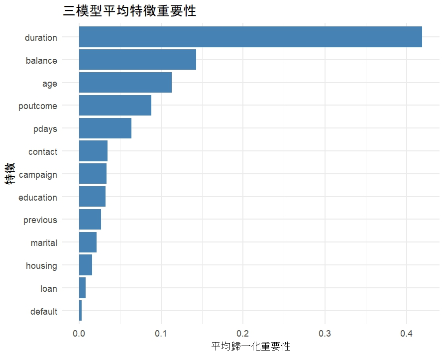
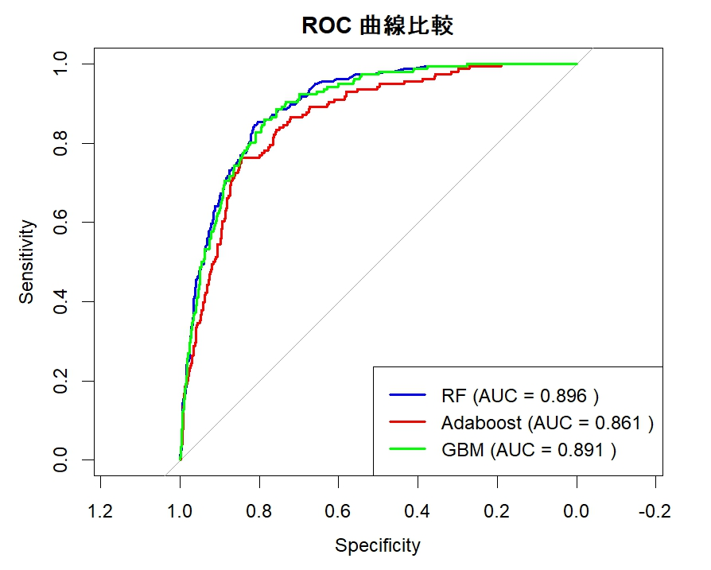

# My-R-project
R Machine Learning Project
📋 簡介

本專案使用 R 語言進行機器學習建模，涵蓋了 資料前處理、模型建構、特徵重要性抽取、效能評估 及 視覺化分析。程式碼包含隨機森林、梯度提升 (GBM) 和 Adaboost 模型，並比較它們的性能與 ROC 曲線表現。
使用 R 進行機器學習模型建構與性能評估 

1. 專案背景 

本專案旨在分析「銀行客戶資料」，預測是否會對某項產品表示正面回應（目標變數：y），並透過不同的機器學習模型比較其效果。本報告涵蓋以下內容： 

資料前處理 

模型建構與特徵重要性分析 

新樣本預測 

模型效能評估與可視化結果 

 

2. 資料前處理 

2.1 資料來源 

使用的資料集為 bank.csv。 

移除了不相關欄位：job, month, day。 

2.2 特徵處理 

將文字型變數轉換為類別型（factor）。 

將目標變數 y 設定為雙層級：no 和 yes。 

2.3 資料集分割 

將資料分為 訓練集（70%） 和 測試集（30%）。 

3. 模型建構與特徵重要性分析 

使用以下三種模型進行建構： 

隨機森林（RF） 

梯度提升機（GBM） 

Adaboost 

 

3.1 特徵重要性分析 

結合所有模型的特徵重要性，計算平均重要性，並繪製可視化長條圖（詳見bankdata報告.docx內容）。 結果： 確定了對模型預測影響較大的核心特徵。 

4. 新樣本預測 

基於訓練集資料，設計了一個新樣本： 

對離散變數使用眾數填充。 

對連續變數使用中位數填充。 

使用三種模型對新樣本進行預測，並生成以下結果： 

隨機森林預測結果： no

Adaboost 預測結果： no

梯度提升機預測結果： yes 

5. 模型效能評估 

 
